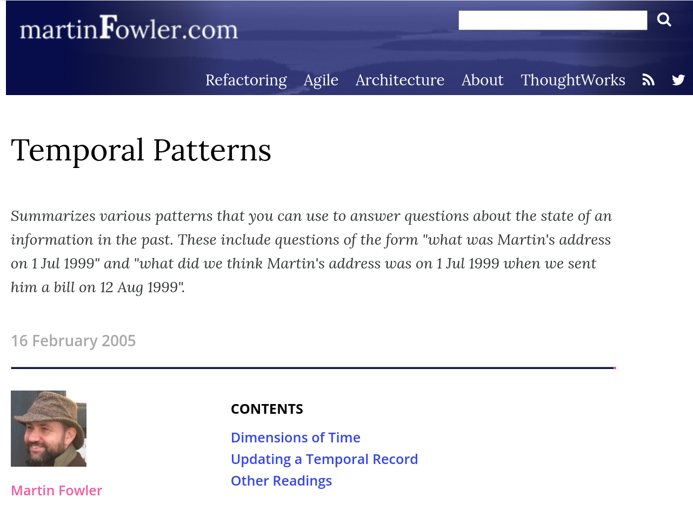

 

---
              

## Design patterns
> *Best practices used by experienced developers.*

              

## Anti-pattern
> *Something that seems like a good idea when you begin, 
> but leads you into trouble.*

              

## Anti-pattern
> *Something that seems like a good idea when you begin, 
> but leads you into trouble.*

## Anti x anti-patterns
> *Cause you some trouble when you begin,
> but prove to be a good idea in the end.*
> 
              